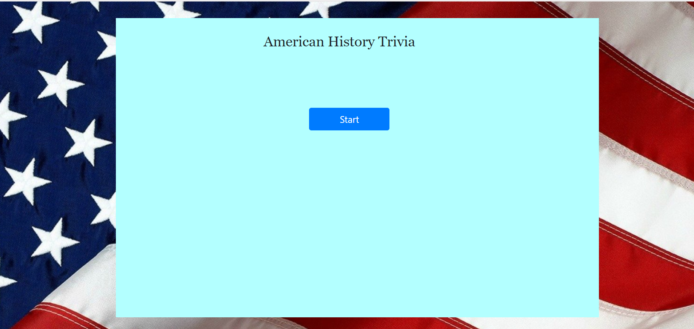
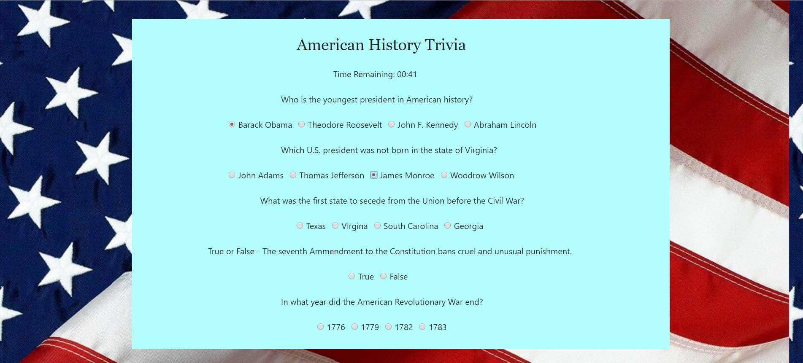
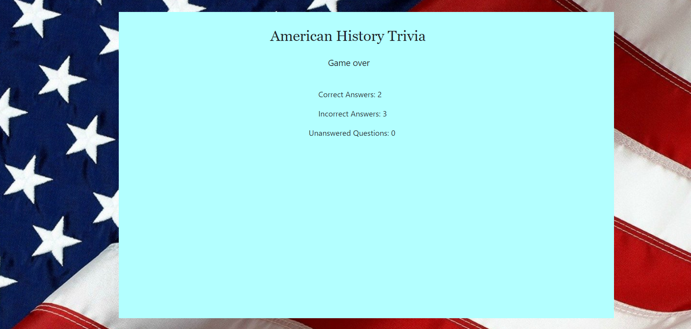

# Trivia Game
This is a trivia game in which the user answers questions about American history. The target user for this game is anyone who is interested in American history or who enjoys testing their knowledge. 

## How to run the site on local machine
The repository can be cloned by clicking the Clone or Download button on the main repository page, then clicking the button next to the url which appears below. Then open a Terminal or Git Bash window, navigate to the location where you want to place the cloned repository, then type 'git clone' and then paste the repository that was just copied. The site can then be opened by clicking on the index.html file and opening it in a web browser.

## Repository organization
The main directory file contains the index.html file, Readme.md file, and the assets folder. Within the assets folder, there are three subfolders - the 'css', 'javascript', and 'images' folders. The 'css' folder contains the style.css file, with determines how the html elements in the index.html file are styled, as well as reset.css, which contains code to ensure that the styling of the html elements appears consistent across different web browsers. Within the 'javascript' folder is game.js, which contains code that determines the logic of the game, including determining what happens in response to the user's behavior. The image folder contains flag.jpq, which contains the background image for the game. Index.html contains all the html code for the site, as well as links to style.css, reset.css, game.js, and to the jQuery and CSS boostrap CDNs. There is also a link to the background image file.

## How to use
After the start button is pressed, a function is executed which hides the start button and creates the html elements for the questions using jQuery. As the user answers the questions, the program keeps track of their correct and incorrect answers and unanswered questions. Users can change their answer for each question, with their most recent response used to determine whether their response was right or wrong for that question. A timer is set and runs for 60 seconds using jQuery as well. When the time reaches zero, the user can't provide any more responses. Then all the questions are hidden and the results are displayed for the number of correct and incorrect responses, as well as the number of unanswered questions. 
  

  

  

  

## Technology used
* HTML
* CSS
* CSS Bootstrap
* JavaScript
* jQuery

## Future improvements
Changes could be made to the UI to make the site more responsive on screens of different sizes. 

## Link to deployed site
https://pkeane2018.github.io/TriviaGame/
